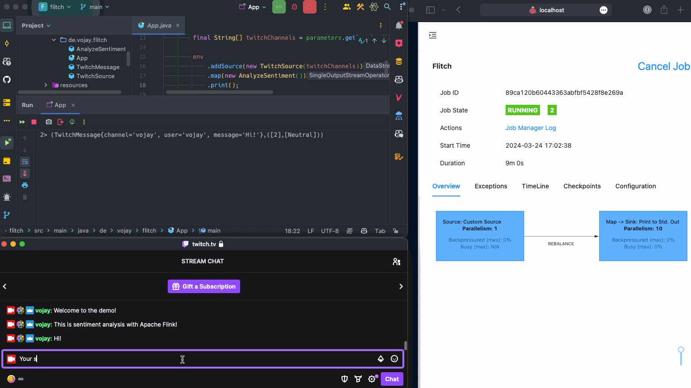
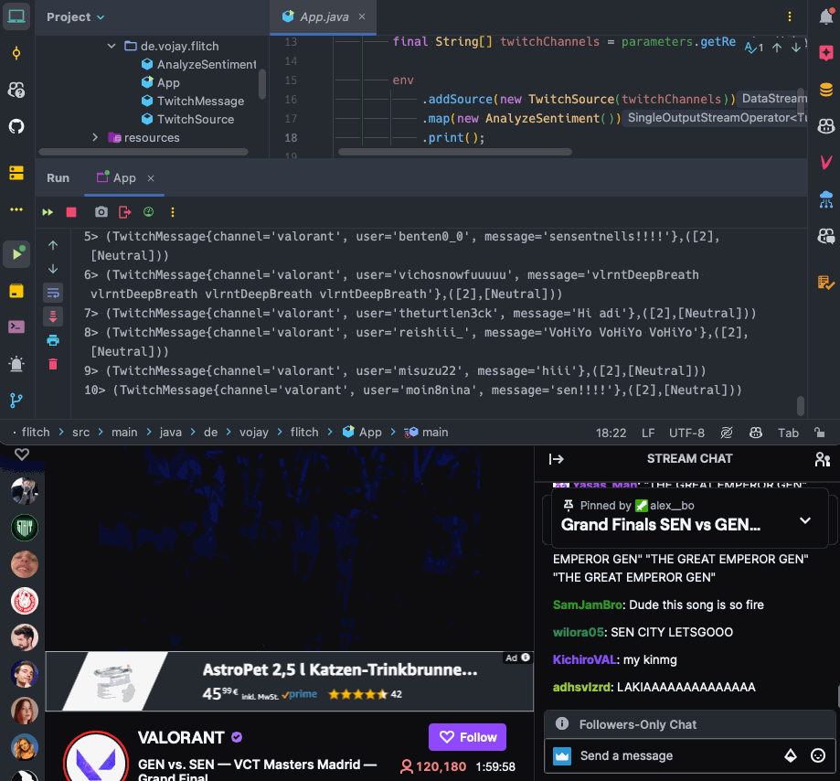

# Flitch - Twitch chat sentiment analysis with Apache Flink

Let's learn about Apache Flink and sentiment analysis by building a real-time sentiment analysis streaming application
for the Twitch chat.

This application is able to process live messages from a Twitch channel and determine the overall sentiment of the chat.

The project was built with the following environment:
* **OS**: macOS Sonoma
* **Java**: 11
* **Flink**: 1.17.2

The underlying idea of this article is: to further educate ourselves in the field of Data Engineering, we should follow
our passion and grow through actual projects.

Find a problem that interests and motivates you, and try to solve it.

**You find more details and a full guide in my article at:** [https://vojay.de/2024/03/25/flink-twitch/](https://vojay.de/2024/03/25/flink-twitch/)
